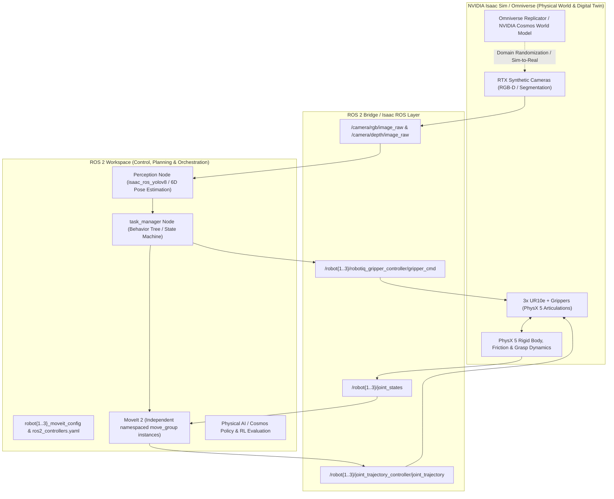

# Multi-Arm UR10e Pick-and-Place: Hybrid Architecture Implementation Plan
## (ROS 2 Jazzy + MoveIt 2 + NVIDIA Isaac Sim / Omniverse + Physical AI)

This document defines the complete end-to-end implementation plan for the **3× UR10e + Robotiq 2F-140 multi-arm robotic cell**. It is built on the **Hybrid Architecture**: leveraging **NVIDIA Isaac Sim (Omniverse)** for photorealistic rendering, PhysX GPU dynamics, synthetic perception, and Physical AI foundation models, coupled with **ROS 2 Jazzy Jalisco (Ubuntu 24.04 LTS) and MoveIt 2** for deterministic trajectory planning, motion execution, and state machine orchestration.

---

## 1. System Architecture Overview



---

## 2. Workspace Layout

```
multi_arm_ws/
└── src/
    ├── docs/                              # Comprehensive project documentation
    │   ├── multi_arm_ur10e_implementation_plan.md
    │   ├── robot_gripper_config_guide.md
    │   ├── isaac_sim_guide.md
    │   └── testing_guide.md
    ├── Universal_Robots_ROS2_Description/ # Official UR10e meshes and xacro macros
    ├── Universal_Robots_ROS2_Driver/      # Official UR ROS 2 driver (for hardware / URSim)
    ├── ros2_robotiq_gripper/              # Robotiq 2F-140 description & action interfaces
    ├── multi_arm_description/             # Assembled UR10e + Robotiq URDFs with prefixes
    ├── robot1_moveit_config/              # MoveIt 2 config for Robot 1 (namespace: /robot1)
    ├── robot2_moveit_config/              # MoveIt 2 config for Robot 2 (namespace: /robot2)
    ├── robot3_moveit_config/              # MoveIt 2 config for Robot 3 (namespace: /robot3)
    ├── multi_arm_bringup/                 # Master launch files, RViz & station YAML configs
    ├── multi_arm_control/                 # Pick/Place action servers & Task Manager
    ├── multi_arm_interfaces/              # PickPlace.action & custom status msgs
    ├── ur_simulation/                     # Isaac Sim Python spawning scripts & USD stages
    └── perception/                        # Isaac ROS YOLOv8 & vision-guided pose estimator
```

---

## 3. Phase-by-Phase Roadmap

---

### Phase 1 — Single UR10e + MoveIt 2 Bringup (Baseline Validation)

**Goal:** Establish a baseline ROS 2 and MoveIt 2 pipeline for a single UR10e arm using mock hardware or URSim before introducing multi-arm or simulation overhead.

#### Architecture Layer
- **ROS 2 Layer:** `ur_description`, `ur_moveit_config`, `ros2_control` mock components.
- **Role:** Verify kinematics solver (KDL/Trac-IK/PickIK), collision self-matrices, and interactive marker execution in RViz.

#### Repos & Tools to Reuse
- **`UniversalRobots/Universal_Robots_ROS2_Driver`** (branch: `jazzy` or `main`)
- **`UniversalRobots/Universal_Robots_ROS2_Description`** (branch: `jazzy` or `main`)

#### Key Commands
```bash
# Terminal 1: Launch Mock Driver
ros2 launch ur_robot_driver ur_control.launch.py ur_type:=ur10e use_mock_hardware:=true launch_rviz:=false

# Terminal 2: Launch MoveIt & RViz
ros2 launch ur_moveit_config ur_moveit.launch.py ur_type:=ur10e use_mock_hardware:=true launch_rviz:=true
```

#### Exit Criteria
Arm plans and executes collision-free trajectories to arbitrary target poses in RViz without IK discontinuities.

---

### Phase 2 — Single Arm + Assembled Gripper Pick-and-Place Action Server

**Goal:** Assemble the Robotiq 2F-140 gripper to the UR10e, calibrate the Tool Center Point (TCP), and implement an action-based Pick & Place execution cycle.

#### Architecture Layer
- **URDF / Xacro:** Combine `ur_macro.xacro` with `robotiq_2f_140_macro.urdf.xacro` attached at `tool0`.
- **ROS 2 Action Layer:** Implement `PickPlace.action` server wrapping `computeCartesianPath` for approach/retreat and `GripperCommand` action for grasping.
- **Config:** Abstract physical waypoints into `stations.yaml`.

#### Key Configuration
```yaml
# multi_arm_bringup/config/stations.yaml
station_a: [0.4, 0.3, 0.2, 0.0, 3.1415, 0.0]
station_b: [0.4, -0.3, 0.2, 0.0, 3.1415, 0.0]
station_c: [0.0, 0.5, 0.2, 0.0, 3.1415, 0.0]
station_d: [0.0, -0.5, 0.2, 0.0, 3.1415, 0.0]
```

#### Exit Criteria
Arm reliably executes: `Approach → Grasp → Retreat → Transit → Approach → Release → Retreat` between Station A and Station B across 20+ automated cycles.

---

### Phase 3 — Three UR10e + Grippers in Isaac Sim (Omniverse Digital Twin)

**Goal:** Simulate 3 independent UR10e manipulator arms with Robotiq grippers in NVIDIA Isaac Sim, linked to independent namespaced ROS 2 MoveIt controllers.

#### Architecture Layer
- **Isaac Sim (Omniverse):** Procedural USD scene with 3 robot prims (`/World/Robot1`, `/World/Robot2`, `/World/Robot3`) powered by PhysX 5 articulation dynamics.
- **ActionGraph / ROS 2 Bridge:** Publishes namespaced `/robot1/joint_states`, `/robot2/joint_states`, `/robot3/joint_states` and subscribes to individual Joint Trajectory Controllers.
- **ROS 2 MoveIt Layer:** Three dedicated `move_group` nodes launched in isolated namespaces (`/robot1`, `/robot2`, `/robot3`) to enable true concurrent trajectory planning.

#### Reference Implementation & Tools
- **Isaac Sim Procedural Spawner:** `src/ur_simulation/scripts/spawn_multi_ur10e.py`
- **Reference Bridge Repo:** `ainhoaarnaiz/ur10e_isaac_sim_ros2`
- **Multi-Arm Namespace Reference:** `arshadlab/multi_robot_arm`

#### Key Commands
```bash
# 1. Launch Isaac Sim with procedural spawner
~/.local/share/ov/pkg/isaac_sim-2023.1.1/python.sh src/ur_simulation/scripts/spawn_multi_ur10e.py

# 2. Press PLAY in Isaac Sim GUI

# 3. Launch the 3 MoveIt instances
ros2 launch multi_arm_bringup multi_arm_isaac_sim.launch.py
```

#### Exit Criteria
All 3 robots appear in Isaac Sim and RViz, maintaining synchronized joint states and executing independent motion planning without topic cross-talk or IK conflicts.

---

### Phase 4 — A → B → C → D Sequential Multi-Arm Coordination

**Goal:** Autonomous handoff of a workpiece across all three robots (Robot 1: A→B, Robot 2: B→C, Robot 3: C→D) coordinated by a state machine or behavior tree.

#### Architecture Layer
- **Task Orchestrator:** `task_manager` node managing finite state machine transitions and querying `PickPlace.action` servers.
- **Physical Contact Simulation:** Isaac Sim PhysX 5 handles physical contact, surface friction, and gripper pinch forces during handoffs at intermediate stations B and C.

#### State Transition Logic
```
[START] 
   │
   ▼
[ROBOT 1: Pick A → Place B] ──(Success)──► [OBJECT AT STATION B]
                                                   │
                                                   ▼
[ROBOT 2: Pick B → Place C] ◄──────────────────────┘
   │
   ▼ (Success)
[OBJECT AT STATION C]
   │
   ▼
[ROBOT 3: Pick C → Place D] ──(Success)──► [TASK COMPLETE]
```

#### Exit Criteria
Object is picked at Station A by Robot 1, placed at Station B, picked by Robot 2, placed at C, picked by Robot 3, and deposited at Station D with zero human intervention.

---

### Phase 5 — Synthetic Vision & GPU Object Detection (Isaac ROS)

**Goal:** Eliminate hard-coded station triggers by using synthetic RTX camera feeds and GPU-accelerated perception to identify workpiece presence and 6D pose in real time.

#### Architecture Layer
- **Isaac Sim Synthetic Sensors:** Overhead or in-hand RTX cameras publishing `/camera/rgb/image_raw` and depth point clouds.
- **Isaac ROS Perception Pipeline:** `isaac_ros_yolov8` or `isaac_ros_detectnet` running via TensorRT on GPU.
- **Perception Node:** Translates bounding box detections and depth back-projection into 3D Cartesian coordinates, updating `task_manager` with verified object locations.

#### Tools to Reuse
- **`NVIDIA-ISAAC-ROS/isaac_ros_object_detection`** (YOLOv8 / RT-DETR / Grounding DINO)
- **NVIDIA Isaac for Manipulation Reference Workflow**

#### Exit Criteria
`task_manager` receives asynchronous ROS 2 messages confirming `OBJECT_DETECTED(station="B", pose=[x,y,z])` before triggering the subsequent pick action.

---

### Phase 6 — Dynamic Multi-Arm Concurrency & Collision Interlocks

**Goal:** Enable simultaneous motion of multiple arms (pipelining multiple objects through A→B→C→D) with dynamic collision avoidance in overlapping workspaces.

#### Architecture Layer
- **Planning Scene Synchronization:** Shared `PlanningSceneWorld` in MoveIt 2 so each arm treats the other arms and current workpieces as dynamic collision obstacles.
- **Spatial Mutex / Interlock Zones:** Software reservations in `task_manager` for shared handoff volumes around Stations B and C.
- **Behavior Tree Execution:** Retries, timeout handling, and preemptive halts on failed grasps.

#### Exit Criteria
At least 2 workpieces simultaneously traversing the cell without deadlocks or physical link-to-link collisions.

---

### Phase 7 — Physical AI, Sim-to-Real & NVIDIA Cosmos Foundation Models

**Goal:** Leverage Isaac Sim and Omniverse as a platform for Physical AI, synthetic data generation, and foundation world-model experiments.

#### Physical AI Research Tracks

1. **Omniverse Replicator & Domain Randomization:**
   - Programmatically randomize lighting, HDRIs, table surface textures, camera noise, and object shapes in Isaac Sim to produce diverse datasets for vision models.
2. **NVIDIA Cosmos World-Foundation Models:**
   - Utilize Cosmos generative physics-aware world models to simulate edge-case scenarios (e.g. object slippage, dynamic visual occlusions, unexpected obstacle intrusion) and validate policy robustness.
3. **Reinforcement Learning / Isaac Lab (Isaac Gym):**
   - Train multi-agent dexterous handoff policies in GPU-accelerated parallel environments (thousands of environments at once) before transferring weights to the ROS 2 MoveIt / control pipeline.

---

## 4. 📊 Implementation Status Summary

| Phase | Milestone / Title | Status | Key Deliverables & Artifacts |
| :---: | :--- | :---: | :--- |
| **P1** | **Single UR10e + MoveIt 2 Baseline Bringup** | `COMPLETED` | Clean ROS 2 Jazzy build, `ur_description`, `ur_moveit_config` verification |
| **P2** | **Composite Gripper (2F-140) + Action Server** | `COMPLETED` | `ur10e_robotiq.urdf.xacro`, `PickPlace.action`, `pick_place_server.py` |
| **P3** | **3× UR10e in Isaac Sim (Digital Twin)** | `COMPLETED` | `spawn_multi_ur10e.py`, `robot{1..3}_moveit_config`, OmniGraph `/clock` & bridges |
| **P4** | **Autonomous Relay Orchestration (A → B → C → D)** | `COMPLETED` | `task_manager.py` state machine, dynamic `/workpiece_marker`, S-curve solver |
| **P5** | **Synthetic Vision & GPU Object Detection** | `PENDING` | RTX Synthetic Cameras, `isaac_ros_yolov8`, dynamic 6D pose estimators |
| **P6** | **Multi-Arm Concurrency & Spatial Mutex** | `PENDING` | MoveIt `PlanningSceneWorld`, collision mutex for buffer stations B & C |
| **P7** | **Physical AI & NVIDIA Cosmos World Models** | `PENDING` | Omniverse Replicator domain randomization, Cosmos world model validation |

---

## 5. Phase Tracking Checklist

- [x] **Phase 1 — Single UR10e + MoveIt 2 Bringup**
  - [x] Clone and build `Universal_Robots_ROS2_Driver` & `Description`
  - [x] Test single-arm trajectory execution with mock hardware in RViz
- [x] **Phase 2 — Assembled Gripper + Pick/Place Server**
  - [x] Create UR10e + Robotiq 2F-140 composite Xacro (`ur10e_robotiq.urdf.xacro`)
  - [x] Define `stations.yaml` station waypoints
  - [x] Implement `pick_place_server.py` wrapping MoveIt Cartesian path planning
- [x] **Phase 3 — Three UR10e in Isaac Sim**
  - [x] Write procedural USD spawner `spawn_multi_ur10e.py`
  - [x] Generate namespaced configs: `robot1_moveit_config`, `robot2_moveit_config`, `robot3_moveit_config`
  - [x] Validate independent `move_group` control via `multi_arm_isaac_sim.launch.py`
- [x] **Phase 4 — A→B→C→D Sequential Coordination**
  - [x] Implement `task_manager.py` state machine
  - [x] Validate autonomous multi-arm handoff across Stations A, B, C, D
- [ ] **Phase 5 — Camera + GPU Object Detection (Isaac ROS)**
  - [ ] Add RTX synthetic camera prims to Isaac Sim scene
  - [ ] Integrate `isaac_ros_yolov8` or ArUco marker pose estimation
  - [ ] Connect perception detections to `task_manager` trigger callbacks
- [ ] **Phase 6 — Dynamic Multi-Arm Concurrency & Interlocks**
  - [ ] Implement spatial mutex / zone locking in `task_manager`
  - [ ] Configure shared MoveIt planning scenes for dynamic collision prevention
  - [ ] Multi-object pipeline load testing
- [ ] **Phase 7 — Physical AI & NVIDIA Cosmos Experiments**
  - [ ] Domain randomization with Omniverse Replicator
  - [ ] Evaluate NVIDIA Cosmos physics/video prediction on manipulation sequences
  - [ ] Sim-to-Real policy validation
