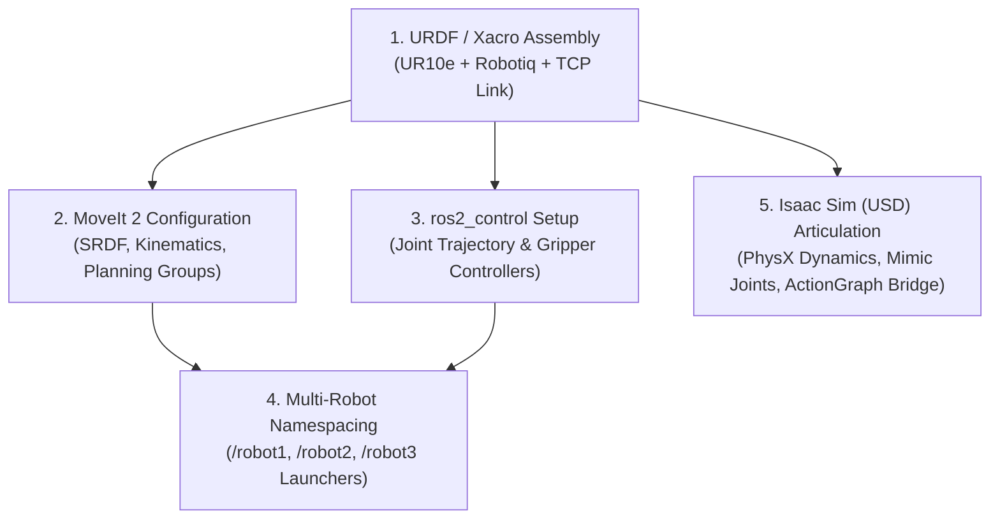

# Guide: Creating ROS 2 & MoveIt 2 Configuration Files for Robots with Assembled Grippers
## Target: ROS 2 Jazzy Jalisco (Ubuntu 24.04 LTS) + MoveIt 2 + NVIDIA Isaac Sim

This guide provides an end-to-end, step-by-step walkthrough for creating, configuring, and deploying a **robot manipulator assembled with an end-effector / gripper** (e.g., **UR10e + Robotiq 2F-140**) for **ROS 2 Jazzy**, MoveIt 2, and NVIDIA Isaac Sim.

---

## 📊 Implementation Status Summary

| Phase | Milestone / Title | Status | Key Deliverables & Artifacts |
| :---: | :--- | :---: | :--- |
| **P1** | **Single UR10e + MoveIt 2 Baseline Bringup** | `COMPLETED` | Clean ROS 2 Jazzy build, `ur_description`, `ur_moveit_config` verification |
| **P2** | **Composite Gripper (2F-140) + Action Server** | `COMPLETED` | `ur10e_robotiq.urdf.xacro`, `PickPlace.action`, `pick_place_server.py` |
| **P3** | **3× UR10e in Isaac Sim (Digital Twin)** | `COMPLETED` | `spawn_multi_ur10e.py`, `robot{1..3}_moveit_config`, OmniGraph `/clock` & bridges |
| **P4** | **Autonomous Relay Orchestration (A → B → C → D)** | `COMPLETED` | `task_manager.py` state machine, dynamic `/workpiece_marker`, S-curve solver |
| **P5** | **Synthetic Vision & GPU Object Detection** | `PENDING` | RTX Synthetic Cameras, `isaac_ros_yolov8`, dynamic 6D pose estimators |
| **P6** | **Multi-Arm Concurrency & Spatial Mutex** | `PENDING` | MoveIt `PlanningSceneWorld`, collision mutex for buffer stations B & C |
| **P7** | **Physical AI & NVIDIA Cosmos World Models** | `PENDING` | Omniverse Replicator domain randomization, Cosmos world model validation |

---

## 1. Overview of Configuration Components

When assembling a gripper onto a robotic arm, you need four primary configuration layers:



---

## 2. Step 1: Assembling the Arm + Gripper in Xacro (URDF)

Create a composite Xacro file (e.g., `multi_arm_description/urdf/ur10e_robotiq.urdf.xacro`) that includes the arm macro, the gripper macro, and joins them with a fixed coupling joint.

### Key Guidelines for the Assembly Xacro:
1. **Always parameterize prefixes:** Ensure every link and joint name can receive a prefix (e.g. `robot1_`, `robot2_`) to support multi-robot setups.
2. **Mount the gripper to `tool0`:** The standard URDF attachment point for Universal Robots is `$(arg prefix)tool0`.
3. **Define a Tool Center Point (TCP) link:** A virtual link placed between the gripper fingertips makes motion planning and grasping much simpler.

```xml
<?xml version="1.0"?>
<robot xmlns:xacro="http://wiki.ros.org/xacro" name="$(arg name)">

  <xacro:arg name="name" default="ur10e_gripper"/>
  <xacro:arg name="prefix" default="" />
  <xacro:arg name="use_fake_hardware" default="false" />

  <!-- 1. Include Arm Macro -->
  <xacro:include filename="$(find ur_description)/urdf/ur_macro.xacro"/>

  <!-- 2. Include Gripper Macro -->
  <xacro:include filename="$(find robotiq_description)/urdf/robotiq_2f_140_macro.urdf.xacro" />

  <!-- World Link -->
  <link name="world" />

  <!-- 3. Instantiate Arm -->
  <xacro:ur_robot
    name="$(arg name)"
    tf_prefix="$(arg prefix)"
    parent="world"
    use_fake_hardware="$(arg use_fake_hardware)"
    initial_positions="${dict(shoulder_pan_joint=0.0,shoulder_lift_joint=-1.57,elbow_joint=0.0,wrist_1_joint=-1.57,wrist_2_joint=0.0,wrist_3_joint=0.0)}">
    <origin xyz="0 0 0" rpy="0 0 0" />
  </xacro:ur_robot>

  <!-- 4. Instantiate Gripper attached to tool0 -->
  <xacro:robotiq_gripper 
    name="$(arg prefix)RobotiqGripper" 
    prefix="$(arg prefix)" 
    parent="$(arg prefix)tool0" 
    use_fake_hardware="$(arg use_fake_hardware)">
    <origin xyz="0 0 0" rpy="0 0 0" />
  </xacro:robotiq_gripper>

  <!-- 5. Define Tool Center Point (TCP) Link for Grasping -->
  <link name="$(arg prefix)tcp" />
  <joint name="$(arg prefix)tool0_to_tcp" type="fixed">
    <parent link="$(arg prefix)tool0" />
    <child link="$(arg prefix)tcp" />
    <!-- Offset to the center of the gripper fingertips (e.g. 23cm along Z) -->
    <origin xyz="0 0 0.23" rpy="0 0 0" />
  </joint>

</robot>
```

---

## 3. Step 2: Generating MoveIt 2 Configuration (MoveIt Setup Assistant)

To generate the MoveIt configuration package for your assembled robot, you can use the **MoveIt Setup Assistant** or generate it programmatically.

### Running MoveIt Setup Assistant
```bash
ros2 launch moveit_setup_assistant setup_assistant.launch.py
```

### Setup Steps Inside the GUI:
1. **Load URDF:** Select "Create New MoveIt Configuration Package" and browse to your Xacro file.
2. **Self-Collision Matrix:** 
   - Click **Generate Collision Matrix** with default sampling (e.g., 10,000 pairs).
   - Verify that collisions between `$(arg prefix)wrist_3_link` and `$(arg prefix)robotiq_base_link` are disabled (since they are rigidly bolted together).
3. **Planning Groups:**
   - **Group 1: `ur_manipulator` (or `arm`)**
     - Kinematic Solver: `kdl_kinematics_plugin/KDLKinematicsPlugin` (or `PickIK`).
     - Add Joints: `shoulder_pan_joint`, `shoulder_lift_joint`, `elbow_joint`, `wrist_1_joint`, `wrist_2_joint`, `wrist_3_joint`.
     - Kinematic Chain Base: `base_link` → Tip: `tcp` (or `tool0`).
   - **Group 2: `gripper`**
     - Add Joints: `finger_joint` (the active drive joint of the gripper).
4. **Robot Poses (Predefined States):**
   - In `ur_manipulator`: Add `home`, `ready`, `stow`.
   - In `gripper`: Add `open` (finger_joint = `0.0`) and `close` (finger_joint = `0.7`).
5. **End-Effectors:**
   - Name: `gripper`
   - End-Effector Group: `gripper`
   - Parent Link: `tcp` (or `tool0`)
   - Parent Group: `ur_manipulator`
6. **ROS 2 Controllers:**
   - Click "Auto-generate ROS 2 Controllers".
   - Generates `joint_trajectory_controller` for the arm and `robotiq_gripper_controller` (or `gripper_action_controller`) for the gripper.
7. **Generate Package:** Save the generated output to `src/robot1_moveit_config/`.

---

## 4. Step 3: Controller Configuration (`ros2_controllers.yaml`)

Your `ros2_controllers.yaml` specifies how the ROS 2 controller manager interacts with the arm and gripper hardware interfaces:

```yaml
controller_manager:
  ros__parameters:
    update_rate: 500  # Hz

    joint_state_broadcaster:
      type: joint_state_broadcaster/JointStateBroadcaster

    joint_trajectory_controller:
      type: joint_trajectory_controller/JointTrajectoryController

    robotiq_gripper_controller:
      type: position_controllers/GripperActionController

joint_trajectory_controller:
  ros__parameters:
    joints:
      - shoulder_pan_joint
      - shoulder_lift_joint
      - elbow_joint
      - wrist_1_joint
      - wrist_2_joint
      - wrist_3_joint
    command_interfaces:
      - position
    state_interfaces:
      - position
      - velocity

robotiq_gripper_controller:
  ros__parameters:
    joint: finger_joint
    action_monitor_rate: 20.0
    goal_tolerance: 0.01
    max_effort: 100.0
    allow_stalling: true
    stall_velocity_threshold: 0.001
    stall_timeout: 0.5
```

---

## 5. Step 4: Multi-Robot Namespacing & Prefixes

For a multi-arm cell (e.g., Robot 1, Robot 2, Robot 3), **each robot must have its own isolated namespace and link/joint prefixes** to avoid topic and TF conflicts.

### Prefix Mapping Strategy
| Robot | Prefix | ROS 2 Namespace | MoveIt Config Package |
| :--- | :--- | :--- | :--- |
| Robot 1 | `robot1_` | `/robot1` | `robot1_moveit_config` |
| Robot 2 | `robot2_` | `/robot2` | `robot2_moveit_config` |
| Robot 3 | `robot3_` | `/robot3` | `robot3_moveit_config` |

### Top-Level Multi-Robot Launch File (`multi_arm_isaac_sim.launch.py`)
Launch each `move_group` inside its own namespace group:

```python
from launch import LaunchDescription
from launch.actions import IncludeLaunchDescription, GroupAction
from launch.launch_description_sources import PythonLaunchDescriptionSource
from launch_ros.actions import PushRosNamespace
from ament_index_python.packages import get_package_share_directory
import os

def generate_launch_description():
    robot1_pkg = get_package_share_directory('robot1_moveit_config')
    robot2_pkg = get_package_share_directory('robot2_moveit_config')
    robot3_pkg = get_package_share_directory('robot3_moveit_config')

    common_args = {
        'use_sim_time': 'true',
        'launch_rviz': 'false'
    }

    return LaunchDescription([
        GroupAction([
            PushRosNamespace('robot1'),
            IncludeLaunchDescription(
                PythonLaunchDescriptionSource(os.path.join(robot1_pkg, 'launch', 'ur_moveit.launch.py')),
                launch_arguments=common_args.items()
            )
        ]),
        GroupAction([
            PushRosNamespace('robot2'),
            IncludeLaunchDescription(
                PythonLaunchDescriptionSource(os.path.join(robot2_pkg, 'launch', 'ur_moveit.launch.py')),
                launch_arguments=common_args.items()
            )
        ]),
        GroupAction([
            PushRosNamespace('robot3'),
            IncludeLaunchDescription(
                PythonLaunchDescriptionSource(os.path.join(robot3_pkg, 'launch', 'ur_moveit.launch.py')),
                launch_arguments=common_args.items()
            )
        ]),
    ])
```

---

## 6. Step 5: Importing the Robot + Gripper into Isaac Sim (Omniverse)

### 1. Using the ROS 2 URDF Importer Extension
1. In Isaac Sim, open **Isaac Utils → Workflows → URDF Importer**.
2. **Settings:**
   - **Fix Base Link:** Checked (anchors the robot base to world).
   - **Drive Type:** `Position` drive for all joints.
   - **Default Drive Strength (Stiffness):** `10,000,000` (for arm joints) / `100,000` (for gripper).
   - **Damping:** `100,000` (arm) / `1,000` (gripper).
   - **Self Collision:** Enabled.
3. Select the processed URDF file (generated via `xacro ur10e_robotiq.urdf.xacro > /tmp/robot.urdf`) and click **Import**.

### 2. Setting Up the ActionGraph / ROS 2 Bridge in Isaac Sim
For each robot prim in Isaac Sim (`/World/Robot1`, `/World/Robot2`, etc.):
- **`ROS2 Context`:** Set Domain ID (default: 0).
- **`ROS2 Publish Joint State`:**
  - Target Articulation: `/World/Robot1`
  - Topic Name: `/robot1/joint_states`
- **`ROS2 Subscribe Joint State` / `FollowJointTrajectory Action Server`:**
  - Subscribes to `/robot1/joint_trajectory_controller/joint_trajectory` and drives the PhysX articulation joints.
- **`ROS2 Gripper Service / Action`:**
  - Subscribes to `/robot1/robotiq_gripper_controller/gripper_cmd` to actuate the gripper fingers.

---

## 7. Verification & Testing

### Test 1: Single Robot Interactive Marker Planning
```bash
ros2 launch robot1_moveit_config ur_moveit.launch.py use_mock_hardware:=true launch_rviz:=true
```
- In RViz, select the `ur_manipulator` group and move the interactive marker.
- Switch to the `gripper` group and verify the gripper opens and closes to predefined states.

### Test 2: Multi-Arm Simulation Execution
1. Run the Isaac Sim spawner:
   ```bash
   ~/.local/share/ov/pkg/isaac_sim-2023.1.1/python.sh src/ur_simulation/scripts/spawn_multi_ur10e.py
   ```
2. Press **Play** in Isaac Sim.
3. Launch all MoveIt instances:
   ```bash
   ros2 launch multi_arm_bringup multi_arm_isaac_sim.launch.py
   ```
4. Verify all joint state topics are publishing:
   ```bash
   ros2 topic list | grep joint_states
   # Output:
   # /robot1/joint_states
   # /robot2/joint_states
   # /robot3/joint_states
   ```
5. Trigger the sequential pick-and-place action pipeline:
   ```bash
   ros2 launch multi_arm_bringup pick_place_servers.launch.py
   ros2 launch multi_arm_bringup task_manager.launch.py
   ```
