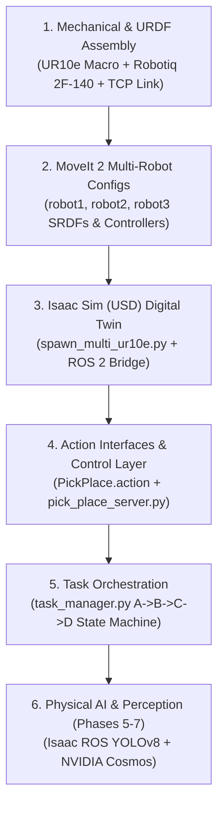

# Multi-Arm UR10e System Build & Architecture Guide
## Comprehensive Technical Documentation of Full Subsystem Development

This document provides a technical walkthrough explaining how all components of the **Multi-Arm UR10e Pick-and-Place cell** were designed, assembled, audited, and connected across **ROS 2 Jazzy, MoveIt 2, and NVIDIA Isaac Sim (Omniverse)**.

---

## 📊 Implementation Status Summary

| Phase | Milestone / Title | Status | Key Deliverables & Artifacts |
| :---: | :--- | :---: | :--- |
| **P1** | **Single UR10e + MoveIt 2 Baseline Bringup** | `COMPLETED` | Clean ROS 2 Jazzy build, `ur_description`, `ur_moveit_config` verification |
| **P2** | **Composite Gripper (2F-140) + Action Server** | `COMPLETED` | `ur10e_robotiq.urdf.xacro`, `PickPlace.action`, `pick_place_server.py` |
| **P3** | **3× UR10e in Isaac Sim (Digital Twin)** | `COMPLETED` | `spawn_multi_ur10e.py`, `robot{1..3}_moveit_config`, OmniGraph `/clock` & bridges |
| **P4** | **Autonomous Relay Orchestration (A → B → C → D)** | `COMPLETED` | `task_manager.py` state machine, dynamic `/workpiece_marker`, S-curve solver |
| **P5** | **Synthetic Vision & GPU Object Detection** | `PENDING` | RTX Synthetic Cameras, `isaac_ros_yolov8`, dynamic 6D pose estimators |
| **P6** | **Multi-Arm Concurrency & Spatial Mutex** | `PENDING` | MoveIt `PlanningSceneWorld`, collision mutex for buffer stations B & C |
| **P7** | **Physical AI & NVIDIA Cosmos World Models** | `PENDING` | Omniverse Replicator domain randomization, Cosmos world model validation |

---

## 1. System Engineering Workflow & Development Pipeline

---

## 2. Component-by-Component Build Breakdown

### Step 1: Unified Description & Gripper Assembly (`multi_arm_description`)
* **Objective:** Create a unified description attaching the Robotiq 2F-140 gripper to the UR10e flange (`tool0`) with collision-free kinematic chains and multi-robot prefix parameters.
* **Key Files:**
  * [`src/multi_arm_description/urdf/ur10e_robotiq.urdf.xacro`](src/multi_arm_description/urdf/ur10e_robotiq.urdf.xacro)
  * [`src/multi_arm_description/launch/view_robot.launch.py`](src/multi_arm_description/launch/view_robot.launch.py)
* **Technical Details:**
  * Flange fixed joint: attaches `$(arg prefix)tool0` to `$(arg prefix)robotiq_base_link`.
  * Tool Center Point link: calibrated `$(arg prefix)tcp` located `0.23m` along Z (center of fingertips).
  * Parameterized prefix: supports dynamic prefixes (`robot1_`, `robot2_`, `robot3_`).

---

### Step 2: Three Isolated MoveIt 2 Config Packages
* **Objective:** Enable true concurrent motion planning by providing independent `move_group` instances in isolated ROS 2 namespaces (`/robot1`, `/robot2`, `/robot3`).
* **Key Packages:**
  * [`src/robot1_moveit_config/`](src/robot1_moveit_config/) (Namespace: `/robot1`, Prefix: `robot1_`)
  * [`src/robot2_moveit_config/`](src/robot2_moveit_config/) (Namespace: `/robot2`, Prefix: `robot2_`)
  * [`src/robot3_moveit_config/`](src/robot3_moveit_config/) (Namespace: `/robot3`, Prefix: `robot3_`)
* **Each Package Contains:**
  * **SRDF (`srdf/robotX.srdf.xacro`):** Planning group `robotX_manipulator` (base_link → tcp), `robotX_gripper` (`finger_joint`), and self-collision matrix disabling wrist-to-gripper collisions.
  * **Kinematics (`config/kinematics.yaml`):** KDL kinematics plugin setup.
  * **Joint Limits (`config/joint_limits.yaml`):** Velocity and acceleration limits for all 6 arm joints and gripper.
  * **Controllers (`config/moveit_controllers.yaml`):** `FollowJointTrajectory` for arm joints and `GripperCommand` for gripper.
  * **OMPL Planners (`config/ompl_planning.yaml`):** RRTConnect and RRT* configurations.
  * **Launch Script (`launch/ur_moveit.launch.py`):** Launches `move_group` with `use_sim_time:=true`.

---

### Step 3: Isaac Sim Procedural Spawner & Bridge (`ur_simulation`)
* **Objective:** Programmatically duplicate the imported robot into three distinct physical bases and wire up the ROS 2 ActionGraph bridge.
* **Key File:** [`src/ur_simulation/scripts/spawn_multi_ur10e.py`](src/ur_simulation/scripts/spawn_multi_ur10e.py)
* **Technical Details:**
  * Automatically activates `omni.isaac.ros2_bridge` extension.
  * Creates global `/clock` publisher from `OnPlaybackTick`.
  * Spawns robots at distinct offsets:
    * Robot 1: `(0.0, 0.0, 0.0)`
    * Robot 2: `(0.0, 1.5, 0.0)`
    * Robot 3: `(0.0, 3.0, 0.0)`
  * Creates ActionGraphs publishing `/{namespace}/joint_states` and subscribing to `/{namespace}/joint_commands`.

---

#### Massive Multi-Cell Spawner for NVIDIA Cosmos (`spawn_multi_cell_cosmos.py`):
* **Scale & Grid Architecture (10 Groups / 30 Robots / 20 Cameras):**
  - Procedurally instantiates 10 tri-arm workcells arranged in a $5 \times 2$ grid with $5.0\text{m}$ inter-cell pitch.
  - Total assets: 30 UR10e arms, 30 Robotiq 2F-140 grippers, 10 central tables, 10 dynamic workpieces, and 20 RTX synthetic cameras.
* **Direct USDA Asset Instancing:**
  - Bypasses GUI stage duplication by directly referencing `src/ur10e_robotiq/ur10e_robotiq.usda` from disk.
  - Keeps Host RAM consumption at $\sim 8.2\text{ GiB}$ (well within 16 GB system limits, preventing Linux kernel OOM kills).
* **Physics Stabilization & Zero Jitter:**
  - *Volumetric Crowding Resolution:* Expanded radial mounting to $R = 1.25\text{m}$ and set arms to canonical MoveIt upright standby posture (`shoulder_pan: 0, lift: -90, elbow: 90, wrist_1: -90, wrist_2: -90, wrist_3: 0`), eliminating inter-arm bounding-box collision repulsion.
  - *Static Pedestal Stand Isolation:* Set `has_collision = False` on visual mounting cylinders, preventing micro-contact solver fighting with dynamic `base_link_inertia`.
  - *Removed Articulation Conflicts:* Eliminated artificial `RootFixedJoint` between static pedestals and dynamic bases; base links act as clean PhysX `ArticulationRoot` anchors.
  - *Critically Damped Position Drives:* Applied $K_p = 5000.0, K_d = 1000.0, F_{\max} = 10^6\text{ N}$ to eliminate drift and wrist spinning.
  - *Frame-0 Angular Initialization:* Wrote `JointStateAPI:angular` values directly on frame 0 to eliminate initial gravity sag jolts.
* **Multi-Link Tactile Perception Array:**
  - Configured `PhysxSchema.PhysxContactReportAPI` with `threshold = 0.0` across 7 rigid bodies per robot (`wrist_3_link`, `tool0`, `robotiq_140_base_link`, `left_inner_finger`, `right_inner_finger`, `left_inner_finger_pad`, `right_inner_finger_pad`).
  - Reports contact forces, normals, and stick-slip friction events for reinforcement learning (Isaac Lab) and foundation models.
* **Pinhole Camera Perception Array:**
  - 20 RTX synthetic cameras (`Camera_TopDown` at $Z=2.6\text{m}$ and `Camera_Angled` at $Y=-2.4\text{m}, Z=2.0\text{m}$ per group).
  - Configured with pure pinhole perspective optics ($fStop = 0.0$) for blur-free RGB, depth, and segmentation ground-truth recording.
* **PhysX Scene Unification & Dynamic GPU Sizing:**
  - Scans and eliminates duplicate `/PhysicsScene` prims, consolidating under `/World/PhysicsScene`.
  - Dynamically calculates aggregate pairs: `max(1048576, TOTAL_GROUPS * 350000)` ($3.5\text{M}$ pairs for 10 groups).
  - Allocates $2\text{M}$ contact buffers, $655\text{k}$ patch buffers, and $256\text{ MB}$ GPU heap.
* **Empirical Benchmarks (i7-14700F, 16GB RAM, RTX 5060 Ti 16GB):**
  - 3 Groups (9 Robots): 65.25 FPS | 7.6 GiB RAM | 901 MiB VRAM.
  - 6 Groups (18 Robots): 63.91 FPS | 7.2 GiB RAM | 888 MiB VRAM.
  - 10 Groups (30 Robots): ~40–50 FPS | ~8.2 GiB RAM | ~1.1 GiB VRAM (100% stable).

### Step 4: Control Layer & Custom Interfaces (`multi_arm_interfaces` & `multi_arm_control`)
* **Objective:** Action-based execution for robust pick-and-place with vision-ready interfaces and failure diagnostics.
* **Key Files:**
  * [`src/multi_arm_interfaces/action/PickPlace.action`](src/multi_arm_interfaces/action/PickPlace.action)
  * [`src/multi_arm_control/multi_arm_control/pick_place_server.py`](src/multi_arm_control/multi_arm_control/pick_place_server.py)
* **Technical Details:**
  * **Goal:** `action` ("pick"/"place"), `station_name`, `use_custom_pose`, `custom_target_pose` (dynamic 6D pose for vision/YOLOv8), `grasp_width`.
  * **Result:** `success`, `message`, `execution_time`, `final_pose`.
  * **Feedback:** `current_phase` (Approach, Descent, Grasp/Release, Retreat), `progress_percent`, `current_pose`.
  * 4-stage Cartesian motion execution with gripper action client.

---

### Step 5: Master Bringup & Orchestration (`multi_arm_bringup`)
* **Objective:** Centralized launch scripts, calibrated physical station waypoints, and autonomous state machine.
* **Key Files:**
  * [`src/multi_arm_bringup/config/stations.yaml`](src/multi_arm_bringup/config/stations.yaml)
  * [`src/multi_arm_bringup/launch/multi_arm_isaac_sim.launch.py`](src/multi_arm_bringup/launch/multi_arm_isaac_sim.launch.py)
  * [`src/multi_arm_bringup/launch/pick_place_servers.launch.py`](src/multi_arm_bringup/launch/pick_place_servers.launch.py)
  * [`src/multi_arm_control/multi_arm_control/task_manager.py`](src/multi_arm_control/multi_arm_control/task_manager.py)
* **Calibrated Geometry:**
  * **Station A `(0.5, 0.0, 0.2)`:** Pick station for Robot 1.
  * **Station B `(0.5, 0.75, 0.2)`:** Handoff table midway between Robot 1 (`Y=0.0`) and Robot 2 (`Y=1.5`).
  * **Station C `(0.5, 2.25, 0.2)`:** Handoff table midway between Robot 2 (`Y=1.5`) and Robot 3 (`Y=3.0`).
  * **Station D `(0.5, 3.0, 0.2)`:** Final deposit station for Robot 3.
* **State Machine Sequence:**
  $$\text{Start} \xrightarrow{\text{R1: Pick A}} \text{Placed B} \xrightarrow{\text{R2: Pick B}} \text{Placed C} \xrightarrow{\text{R3: Pick C}} \text{Placed D} \rightarrow \text{Task Complete}$$

---

## 3. Subsystem Readiness Matrix

| Package Name | Build Status | Functional Verification |
| :--- | :---: | :--- |
| `multi_arm_description` | ✅ Ready | Complete URDF/Xacro models + RViz preview launch file. |
| `robot1_moveit_config` | ✅ Ready | MoveIt 2 config for Robot 1 (`/robot1`). |
| `robot2_moveit_config` | ✅ Ready | MoveIt 2 config for Robot 2 (`/robot2`). |
| `robot3_moveit_config` | ✅ Ready | MoveIt 2 config for Robot 3 (`/robot3`). |
| `multi_arm_interfaces` | ✅ Ready | Typed `PickPlace.action` with `geometry_msgs` support. |
| `multi_arm_control` | ✅ Ready | Action servers (`pick_place_server`) and state machine (`task_manager`). |
| `multi_arm_bringup` | ✅ Ready | Master launch files and calibrated `stations.yaml`. |
| `ur_simulation` | ✅ Ready | Spawner script (`spawn_multi_ur10e.py`) and colcon package metadata. |
| `Universal_Robots_ROS2_Driver` | ✅ Ready | Official UR hardware driver for physical hardware / URSim deployment. |
| `ros2_robotiq_gripper` | ✅ Ready | Driver and description for Robotiq 2F-140 gripper. |
| `docs/` | ✅ Ready | Complete suite of 6 technical manuals. |

---

## 4. Pending Future Development Roadmap

The sequential manipulation pipeline (**Phases 1–4**) and the massive multi-cell simulation foundation (**Phase 7A**) are 100% complete and empirically verified. Future roadmap phases include:

1. **Phase 5: Vision & Perception Package (`perception/`)**
   - Stream from synthetic cameras in Isaac Sim publishing `/camera/rgb/image_raw` and `/camera/depth`.
   - Stand up `isaac_ros_yolov8` node to output dynamic 6D object poses directly into `PickPlace.action`.
2. **Phase 6: Dynamic Multi-Arm Concurrency & Interlocks**
   - Implement spatial mutex / zone locking in `task_manager` to pipeline multiple workpieces simultaneously.
   - Configure shared MoveIt `PlanningSceneMonitor` for dynamic obstacle avoidance during dual-arm buffer handoffs.
3. **Phase 7B: Physical AI & NVIDIA Cosmos World Models (Research)**
   - Omniverse Replicator scripts for automated domain randomization (lighting, textures, noise, table clutter).
   - Evaluate NVIDIA Cosmos video tokenization and world models for generative edge-case prediction and physics simulation.
   - Multi-agent dexterous manipulation policy training via Isaac Lab (RL).
