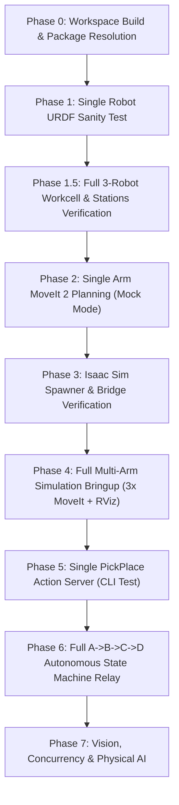

# Multi-Arm UR10e Pick-and-Place: Phase-by-Phase Testing & Verification Playbook
## Target: ROS 2 Jazzy Jalisco + MoveIt 2 + NVIDIA Isaac Sim (Omniverse)

This playbook is designed for **isolated, unit-by-unit testing**. Test and verify each phase independently before moving to the next.

---

## 📊 Implementation Status Summary

| Phase | Milestone / Title | Status | Key Deliverables & Artifacts |
| :---: | :--- | :---: | :--- |
| **P1** | **Single UR10e + MoveIt 2 Baseline Bringup** | `COMPLETED` | Clean ROS 2 Jazzy build, `ur_description`, `ur_moveit_config` verification |
| **P2** | **Composite Gripper (2F-140) + Action Server** | `COMPLETED` | `ur10e_robotiq.urdf.xacro`, `PickPlace.action`, `pick_place_server.py` |
| **P3** | **3× UR10e in Isaac Sim (Digital Twin)** | `COMPLETED` | `spawn_multi_ur10e.py`, `robot{1..3}_moveit_config`, OmniGraph `/clock` & bridges |
| **P4** | **Autonomous Relay Orchestration (A → B → C → D)** | `COMPLETED` | `task_manager.py` state machine, dynamic `/workpiece_marker`, S-curve solver |
| **P5** | **Synthetic Vision & GPU Object Detection** | `PENDING` | RTX Synthetic Cameras, `isaac_ros_yolov8`, dynamic 6D pose estimators |
| **P6** | **Multi-Arm Concurrency & Spatial Mutex** | `PENDING` | MoveIt `PlanningSceneWorld`, collision mutex for buffer stations B & C |
| **P7** | **Physical AI & NVIDIA Cosmos World Models** | `PENDING` | Omniverse Replicator domain randomization, Cosmos world model validation |

---

## 🗺️ Progressive Testing Workflow



---

## Phase 0: Workspace Build & Dependency Resolution

**Goal:** Verify all C++ and Python ROS 2 packages compile cleanly and install without missing header or message dependencies.

### Clean Workspace & Full Build:
Run from your workspace root (`MultiArm-Pick-and-Place`):

```bash
# 1. Clean previous build artifacts:
rm -rf build/ install/ log/

# 2. Source ROS 2 Jazzy:
source /opt/ros/jazzy/setup.bash

# 3. Full build with symlinks:
colcon build --symlink-install
source install/setup.bash
```

### Selective Package Build Commands (Fast Iteration):
When modifying specific components, build only what is necessary instead of rebuilding the entire workspace:

```bash
# 1. Build custom interfaces (Action & Service definitions):
colcon build --packages-select multi_arm_interfaces --symlink-install

# 2. Build robot description & workcell models (URDF/Xacro/Meshes/RViz):
colcon build --packages-select multi_arm_description --symlink-install

# 3. Build MoveIt 2 configs (SRDF, kinematics, controllers for Robots 1, 2, 3):
colcon build --packages-select robot1_moveit_config robot2_moveit_config robot3_moveit_config --symlink-install

# 4. Build Python control nodes (Action Servers & Task Manager):
colcon build --packages-select multi_arm_control --symlink-install

# 5. Build top-level launch & bringup package:
colcon build --packages-select multi_arm_bringup --symlink-install

# 6. Build Isaac Sim simulation spawner:
colcon build --packages-select ur_simulation --symlink-install

# 7. Build a specific package AND all of its upstream dependencies:
colcon build --packages-up-to multi_arm_bringup --symlink-install
```

> [!TIP]
> **Symlink Install Advantage:** Because `--symlink-install` is used, direct changes to Python scripts (`pick_place_server.py`, `task_manager.py`), launch files, and YAML configs (`stations.yaml`) take effect immediately **without needing to re-run `colcon build`**. You only need to rebuild if you modify `package.xml`, `CMakeLists.txt`, C++ sources, or action interfaces.

### Verification Checklist:
- [ ] `multi_arm_description` finished
- [ ] `multi_arm_interfaces` finished
- [ ] `robot1_moveit_config`, `robot2_moveit_config`, `robot3_moveit_config` finished
- [ ] `multi_arm_control` finished
- [ ] `multi_arm_bringup` finished
- [ ] `ur_simulation` finished

**Pass Criteria:** 0 build failures.

---

## Phase 1: Single Robot & Gripper URDF Sanity Test

**Goal:** Verify that the combined UR10e + Robotiq 2F-140 Xacro model parses cleanly, displays all meshes, and includes the Tool Center Point (TCP) link.

### Command:
```bash
ros2 launch multi_arm_description view_robot.launch.py
```

### Verification Checklist:
1. RViz opens displaying the UR10e arm with the Robotiq 2F-140 gripper attached at `tool0`.
2. Move joint sliders in `joint_state_publisher_gui`:
   - Arm joints (`shoulder_pan`, `shoulder_lift`, `elbow`, `wrist_1`, `wrist_2`, `wrist_3`) rotate properly.
   - Gripper joints (`left_outer_knuckle`, `left_inner_finger`, etc.) move synchronously.
3. In RViz **TF** tree display: verify `tcp` link exists and sits between the fingertip pads.

**Pass Criteria:** No missing mesh warnings in terminal. Close RViz (`Ctrl+C`) when verified.

---

## Phase 1.5: Full 3-Robot Workcell & Stations Visual Verification

**Goal:** Verify all 3 UR10e arms, Robotiq 2F-140 grippers, mounting pedestals, cell boundary demarcations, and Stations A, B, C, and D are correctly rendered in their relative spatial layout.

### Command:
```bash
ros2 launch multi_arm_description view_workcell.launch.py
```

### Spatial Layout & Workcell Reference:
- **Base Platform:** Enlarged $2.4\text{ m} \times 5.6\text{ m}$ ground plate ($X \in [-0.80\text{ m}, +1.60\text{ m}]$, $Y \in [-1.20\text{ m}, +4.40\text{ m}]$).
- **Cell 1 (Robot 1 at $X=0.0, Y=0.0$):**
  - **Station A (WS1 - Source Table):** Located at $(X=0.70, Y=0.00, Z=0.25)$ with a pickable **Emerald Green Workpiece Cube**.
- **Relay Zone 1 (Station B / WS2 - Handoff Buffer 1):**
  - Amber handoff table located at $(X=0.70, Y=0.80, Z=0.25)$ centered between Robot 1 and Robot 2.
- **Cell 2 (Robot 2 at $X=0.0, Y=1.6$):**
  - Reaches both Relay 1 ($Y=0.80$) and Relay 2 ($Y=2.40$).
- **Relay Zone 2 (Station C / WS3 - Handoff Buffer 2):**
  - Amber handoff table located at $(X=0.70, Y=2.40, Z=0.25)$ centered between Robot 2 and Robot 3.
- **Cell 3 (Robot 3 at $X=0.0, Y=3.2$):**
  - **Station D (WS4 - Destination Dropoff Table):** Located at $(X=0.70, Y=3.20, Z=0.25)$.
- **Safety Demarcations:** Yellow industrial boundary strips along $Y=0.80$, $Y=2.40$, and front safety line $X=1.45$.

### Verification Checklist:
1. RViz displays the full workcell platform with all 3 robots standing in upright ready poses above their $Z=0.20\text{ m}$ pedestals.
2. The green cube is visible resting on Station A (WS1).
3. Joint sliders in `joint_state_publisher_gui` allow independent articulation of all 18 arm joints and 18 gripper joints across all three robots.

---

## Phase 2: Single Arm MoveIt 2 Interactive Planning (Mock Mode)

**Goal:** Verify kinematic reachability, SRDF collision avoidance matrices, and trajectory planning for individual robots without requiring simulation.

### Commands:
```bash
# Test Robot 1 MoveIt & RViz:
ros2 launch robot1_moveit_config ur_moveit.launch.py

# Test Robot 2 MoveIt & RViz:
ros2 launch robot2_moveit_config ur_moveit.launch.py

# Test Robot 3 MoveIt & RViz:
ros2 launch robot3_moveit_config ur_moveit.launch.py
```

### Verification Checklist:
1. RViz opens with the MotionPlanning display active.
2. Drag the interactive 6D marker to an arbitrary reachable pose and click **Plan & Execute**.
3. Arm moves to the target pose smoothly without IK failure warnings.
4. Select named states: `home`, `ready`, and verify motion.

**Pass Criteria:** Planning group resolves kinematics cleanly without IK discontinuities.

---

## Phase 3: Isaac Sim Procedural Spawning & ROS 2 Bridge Test

**Goal:** Verify that Isaac Sim imports the URDF, duplicates the three robots at distinct base coordinates, and publishes namespaced ROS 2 joint states and clocks.

### Step-by-Step Execution:
1. **Export the URDF:**
   ```bash
   xacro src/multi_arm_description/urdf/ur10e_robotiq.urdf.xacro > /tmp/ur10e_robotiq.urdf
   ```
2. **Import into Isaac Sim:**
   - Open Isaac Sim (version 4.x / 4.5+).
   - Menu: **Isaac Utils → Workflows → URDF Importer**.
   - Input file: `/tmp/ur10e_robotiq.urdf`
   - Settings: `Fix Base Link = True`, `Drive Type = Position`.
   - Click **Import** (creates `/World/ur10e_robotiq` or `/World/UR10e`).
3. **Execute the Multi-Arm Spawner:**
   - In Isaac Sim menu: **Window → Script Editor**.
   - Open and run [`src/ur_simulation/scripts/spawn_multi_ur10e.py`](file:///Users/shivammaurya/Desktop/ros2_ws/nextup/multi_arm_ws/MultiArm-Pick-and-Place/src/ur_simulation/scripts/spawn_multi_ur10e.py).
   - *Result:* Three robot prims appear at:
     - Robot 1: `(0.0, 0.0, 0.0)`
     - Robot 2: `(0.0, 1.6, 0.0)`
     - Robot 3: `(0.0, 3.2, 0.0)`
4. **Press PLAY (▶) in Isaac Sim.**

### ROS 2 Topic Verification (New Terminal):
```bash
source /opt/ros/jazzy/setup.bash

# 1. Verify topics exist:
ros2 topic list | grep -E "clock|robot"
```
**Expected Topics:**
```
/clock
/robot1/joint_states
/robot1/joint_commands
/robot2/joint_states
/robot2/joint_commands
/robot3/joint_states
/robot3/joint_commands
```

```bash
# 2. Check joint state publish frequency:
ros2 topic hz /robot1/joint_states
```
*Output should show steady ~60 Hz matching simulation physics.*

**Pass Criteria:** All 3 joint state topics and `/clock` are actively streaming.

---

## Phase 4: Full Multi-Arm Simulation Bringup (3x MoveIt + RViz)

**Goal:** Launch the unified simulation environment bringing up MoveIt 2 for all 3 robots, action servers, and RViz workcell visualization simultaneously.

### Command:

- **Standalone Simulation (without Isaac Sim):**
  ```bash
  source /opt/ros/jazzy/setup.bash
  source install/setup.bash
  ros2 launch multi_arm_bringup multi_arm_simulation.launch.py use_sim_time:=false
  ```

- **With NVIDIA Isaac Sim Physics:**
  ```bash
  source /opt/ros/jazzy/setup.bash
  source install/setup.bash
  ros2 launch multi_arm_bringup multi_arm_simulation.launch.py use_sim_time:=true
  ```

### Verification Checklist:
1. Terminal confirms all 3 MoveIt nodes started:
   - `/robot1/move_group`
   - `/robot2/move_group`
   - `/robot3/move_group`
2. Action servers are started in their respective namespaces:
   - `/robot1/pick_place`
   - `/robot2/pick_place`
   - `/robot3/pick_place`
3. RViz displays the complete 3-robot workcell and stations.

---

## Phase 5: Single Action Server CLI Test (`PickPlace.action`)

**Goal:** Verify that an individual robot action server accepts goals, controls the gripper, and moves the arm through the 4-phase sequence.

### Step-by-Step Execution:
1. While `multi_arm_simulation.launch.py` is running, open a new terminal:
   ```bash
   source /opt/ros/jazzy/setup.bash
   source install/setup.bash

   # Send Pick goal to Robot 1 at Station A (WS1):
   ros2 action send_goal /robot1/pick_place multi_arm_interfaces/action/PickPlace "{action: 'pick', station_name: 'A', grasp_width: 0.06}" --feedback
   ```

### Verification Checklist:
- [ ] Terminal reports `Feedback: APPROACHING (25%)`
- [ ] Terminal reports `Feedback: DESCENDING (50%)`
- [ ] Gripper opens and terminal reports `Feedback: GRASPING (75%)`
- [ ] Terminal reports `Feedback: RETREATING (90%)`
- [ ] Final result returned: `success: true, message: 'Successfully completed pick at station A'`.

**Pass Criteria:** Action goal succeeds and reports execution time.

---

## Phase 6: Full Multi-Arm Autonomous State Machine (A → B → C → D)

**Goal:** Execute the complete end-to-end handoff across all 3 arms with zero manual intervention.

### Command Execution:
With simulation running in Terminal 1, run the Task Manager in Terminal 2:

```bash
source /opt/ros/jazzy/setup.bash
source install/setup.bash
ros2 run multi_arm_control task_manager
```

### Expected Execution Log:
```
[task_manager]: Waiting for robot1, robot2, robot3 pick/place servers...
[task_manager]: All servers connected. Starting A->D sequence!
[task_manager]: --- STEP 1/6 --- Commanding robot1 to PICK at station A
[task_manager]: Feedback: APPROACHING (25%) -> DESCENDING (50%) -> GRASPING (75%) -> RETREATING (90%)
[task_manager]: Step 1 successful (2.85s)
[task_manager]: --- STEP 2/6 --- Commanding robot1 to PLACE at station B
[task_manager]: Step 2 successful (3.10s)
[task_manager]: --- STEP 3/6 --- Commanding robot2 to PICK at station B
[task_manager]: Step 3 successful (2.90s)
[task_manager]: --- STEP 4/6 --- Commanding robot2 to PLACE at station C
[task_manager]: Step 4 successful (3.05s)
[task_manager]: --- STEP 5/6 --- Commanding robot3 to PICK at station C
[task_manager]: Step 5 successful (2.95s)
[task_manager]: --- STEP 6/6 --- Commanding robot3 to PLACE at station D
[task_manager]: Step 6 successful (3.12s)
[task_manager]: ====================================
[task_manager]: TASK MANAGER SEQUENCE COMPLETE! A->D
[task_manager]: ====================================
```

**Pass Criteria:** Object traverses from Station A to Station D with clean handoffs at B and C.

---

## Phase 7: Progression to Future Phases

Once Phases 0–6 pass successfully, proceed to the remaining roadmap phases:

### Phase 5: Vision & Perception (`isaac_ros_yolov8`)
1. Add synthetic camera in Isaac Sim publishing `/camera/rgb/image_raw`.
2. Stand up detection node to output `custom_target_pose`.
3. Send action goal with `use_custom_pose: true`:
   ```python
   goal.use_custom_pose = True
   goal.custom_target_pose = detected_pose
   ```

### Phase 6: Dynamic Multi-Arm Concurrency
1. Update `task_manager` queue to handle 2+ objects simultaneously.
2. Add mutex reservation for Stations B & C so Robot 1 and Robot 2 do not enter the handoff volume at the same instant.

### Phase 7: Physical AI & NVIDIA Cosmos
1. Run Omniverse Replicator domain randomization scripts.
2. Evaluate policy robustness using Cosmos generative physics world models.

---

## 🛠️ Quick Troubleshooting Guide

| Issue | Root Cause | Solution |
| :--- | :--- | :--- |
| `move_group` hangs waiting for clock | `use_sim_time:=true` is set but Isaac Sim is paused or not running | Set `use_sim_time:=false` for standalone testing, or click **PLAY (▶)** in Isaac Sim. |
| Topics not showing in `ros2 topic list` | `omni.isaac.ros2_bridge` extension disabled | In Isaac Sim: **Window → Extensions → Search 'ros2_bridge' → Enable & Autoload**. |
| Kinematic planning fails at Station B/C | Station is outside arm reach | Verify `stations.yaml`: Station B is `(0.70, 0.80, 0.25)` and Station C is `(0.70, 2.40, 0.25)`. |
| RViz shows white/error links | `robot_state_publisher` not publishing `/robot_description` or `/tf` | Launch using the provided launch files (`view_workcell.launch.py` or `multi_arm_simulation.launch.py`). |
| Gripper fingers pass through workpiece | PhysX collision meshes not set | In Isaac Sim, select workpiece and gripper fingertips → Add **Physics → Rigid Body with Colliders**. |
